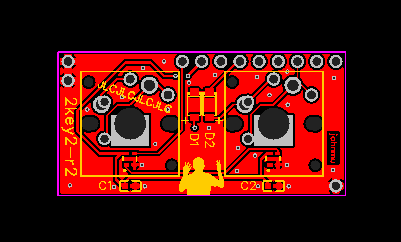
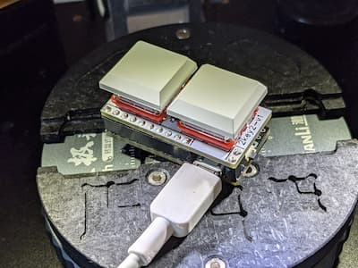

# 2key2 - a 2-key, 2-WS2812B keyboard for 3-key-ecosystem

Hardware status: ok

QMK status: working, not submitted to QMK yet

Requires [kbmount](../../kbmount/) C/A rev.2+ base plate

USB VID/PID: [0x1209 / 0x3304](https://pid.codes/1209/3304/)

Switch types supported:

* Cherry MX, without LED
* Kailh CPG1350 low-profile, w/WS2812B 2020
* Kailh CPG1425 Butterfly low-profile, w/WS2812B 2020

## Pins

Left/Top:

1. GND
2. GND

Top:

1. WS2812B DI -> PB2 / D16
2. VCC (not used) -> VCC
3. COL1 -> PF4 / D21 / A3
4. ROW1 -> PF6 / D19 / A1
5. (not used) -> PC6 / D5
6. (not used) -> PB5 / D9
7. COL2 -> PD7 / D6
8. (not used) -> PD3 / D1
9. (not used) -> PD1 / D2

Right/Bottom:

1. GND

## Hardware

* 2x Switches
* 2x Diode 1N4148, size SOD123 (or jump with 0R resistor 0805)
* 2x WS2812B 2020
* 2x Capacitor 100nF (0.1uF), size 0603

## Links

* [QMK keyboard](https://github.com/softplus/3keyecosystem-qmk/tree/main/2key/2key2)
* [Schematic](schematic.pdf)
* [EasyEDA](https://easyeda.com/editor#id=f02851dca3144e32a231e3b39103f030)
* [Gerber files](gerber.zip)
* EasyEDA JSON files: [PCB](easyeda-pcb.json) / [Schematic](easyeda-schematic.json)
