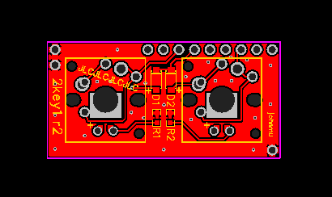
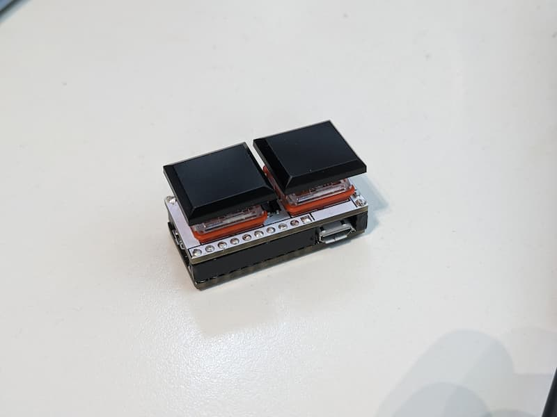

# 2key1 - a 2-key, 2-LED keyboard for 3-key-ecosystem

Hardware status: ok

QMK status: working, not cleaned up

Requires [kbmount](../kbmount/) C/A rev2+ base plate

Switch types supported:

* Cherry MX, w/TH LED
* Kailh CPG1350 low-profile, w/SMD LED
* Kailh CPG1425 Butterfly low-profile, w/SMD LED

## Pins

Left/Top: 

1. GND
2. GND

Top:

1. LED1 -> PB2 / D16
2. VCC (not used) -> VCC
3. COL1 -> PF4 / D21 / A3
4. ROW1 -> PF6 / D19 / A1
5. (not used) -> PC6 / D5
6. (not used) -> PB5 / D9
7. COL2 -> PD7 / D6
8. LED2 -> PD3 / D1
9. (not used) -> PD1 / D2

Right/Bottom:

1. GND

## Hardware

* 2x Switches
* 2x Diode 1N4148, size SOD123 (or jump with 0R resistor 0805)
* 2x Resistor 0603 for LED, eg 330R

## Links

* [QMK keyboard](https://github.com/softplus/3keyecosystem-qmk/tree/main/2key1)
* [Schematic](schematic.pdf)
* [EasyEDA v1](https://easyeda.com/account/project/setting/basic?project=8973a52ca8d5454cb516ae101822be3a)
* [Gerber files v1](gerber.zip)
