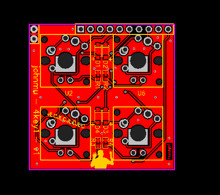

# 4key1 - a 2x2-key, 4-LED keyboard for 3-key-ecosystem

Hardware status: in redesign :-/

QMK status: working, not cleaned up

Requires [kbmount](../kbmount/) base plate

Switch types supported:

* Cherry MX, w/TH LED
* Kailh CPG1350 low-profile, w/SMD LED
* Kailh CPG1425 Butterfly low-profile, w/SMD LED

## Pins

Left/Top:

1. GND
2. GND

Top:

1. VCC (not used) -> VCC
2. LED1 -> PB2 / D16
3. RESET (not used) -> RESET
4. COL1 -> PF4 / D21 / A3
5. ROW1 -> PF6 / D19 / A1
6. ROW2 -> PC6 / D5
7. LED3 -> PB5 / D9
8. COL2 -> PD7 / D6
9. LED2 -> PD3 / D1
10. LED4 -> PD1 / D2

Right/Bottom:

1. GND

## Hardware

* 4x Switches
* 4x Diode 1N4148, size SOD123 (or jump with 0R resistor 0805)
* 4x Resistor 0603 for LED, eg 330R

## Links

* [QMK keyboard](https://github.com/softplus/3keyecosystem-qmk/tree/main/4key1)
* [Schematic](schematic.pdf)
* [EasyEDA v1](https://easyeda.com/account/project/setting/basic?project=ddb5d2dfa4ea4dcbadc4e1aa57231959)
* [Gerber files v1](gerber.zip)
