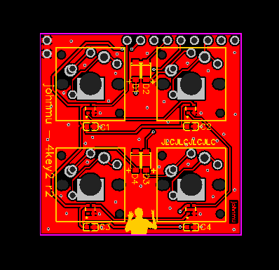

# 4key2 - a 2x2-key, 4-WS2812B keyboard for 3-key-ecosystem

Hardware status: ok

QMK status: working, not cleaned up

Requires [kbmount](../kbmount/) C/A rev.2+ base plate

Switch types supported:

* Cherry MX, without LED
* Kailh CPG1350 low-profile, w/WS2812B 2020
* Kailh CPG1425 Butterfly low-profile, w/WS2812B 2020

## Pins

Left/Top: 

1. GND
2. GND

Top:

1. WS2812B DI -> PB2 / D16
2. VCC (not used) -> VCC
3. COL1 -> PF4 / D21 / A3
4. ROW1 -> PF6 / D19 / A1
5. ROW2 -> PC6 / D5
6. (not used) -> PB5 / D9
7. COL2 -> PD7 / D6
8. (not used) -> PD3 / D1
9. (not used) -> PD1 / D2

Right/Bottom:

1. GND

## Hardware

* 4x Switches
* 4x Diode 1N4148, size SOD123
* 4x WS2812B 2020
* 4x Capacitor 100nF (0.1uF), size 0603
* 
## Links

* [QMK keyboard](https://github.com/softplus/3keyecosystem-qmk/tree/main/4key2)
* [Schematic](schematic.pdf)
* [EasyEDA URL](https://easyeda.com/editor#id=9d75b292088f4e02ada83b2bd71683f4)
* [Gerber files](gerber.zip)
* EasyEDA JSON: [schematic](easyeda-schematic.json)
  / [PCB](easyeda-pcb.json)
