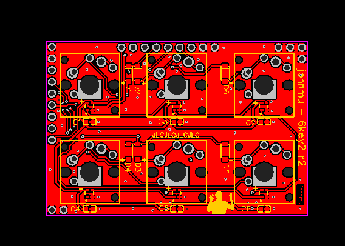

# 6key2 - a 3x2 & 2x3-key, 6-WS2812B keyboard for 3-key-ecosystem

Hardware status: ok

QMK status: working, not cleaned up

Requires [kbmount](../../kbmount/) C/A rev.2+ base plate

USB VID/PID: (submitted, tbd) 0x1209 / 0x3306

Switch types supported:

* Cherry MX, without LED
* Kailh CPG1350 low-profile, w/WS2812B 2020
* Kailh CPG1425 Butterfly low-profile, w/WS2812B 2020

## Pins

Left/Top:

1. GND
2. GND

Top and side:

1. WS2812B DI -> PB2 / D16
2. VCC -> VCC
3. COL1 -> PF4 / D21 / A3
4. ROW1 -> PF6 / D19 / A1
5. ROW2 -> PC6 / D5
6. COL2 -> PB5 / D9
7. COL3 -> PD7 / D6
8. GND
9. GND

Right/Bottom:

1. GND

## Hardware

* 6x Switches
* 6x Diode 1N4148, size SOD123
* 6x WS2812B 2020
* 6x Capacitor 100nF (0.1uF), size 0603

## Links

* [QMK keyboard](https://github.com/softplus/3keyecosystem-qmk/tree/main/6key/6key2)
* [Schematic](schematic.pdf)
* [EasyEDA](https://easyeda.com/editor#id=0337f5be63b347af9cc7bd1799a95ee6)
  / [sidemount](https://easyeda.com/editor#id=b84796d454ab4c84848290706b596876)
* [Gerber files](gerber.zip)
* Sidemount: [board](board-side.png) / [gerbers](gerber-side.zip)
* EasyEDA JSON: [schematic](easyeda-schematic.json)
  / [PCB](easyeda-pcb.json)
* EasyEDA Sidemount JSON: [schematic](easyeda-side-schematic.json)
  / [PCB](easyeda-side-pcb.json)
