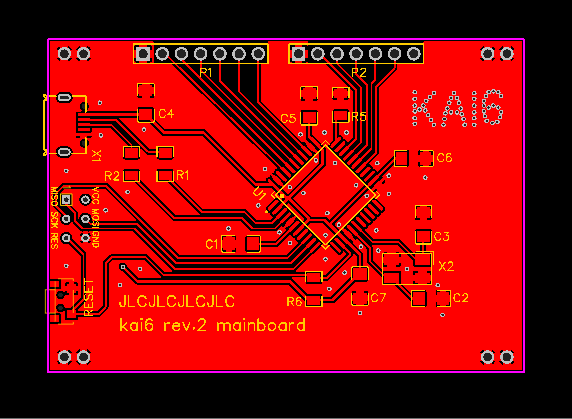
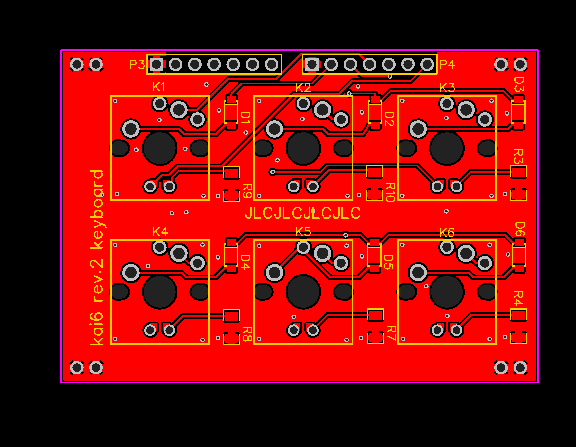

# kai6 - a hand-solderable 6-key macro keyboard

Hardware status: ok
QMK status: ok, not submitted

USB VID/PID: (submitted, tbd) 0x1209 / 0x3306

Switch types supported:

* Cherry MX, w/TH LED
* Kailh CPG1350 low-profile, w/SMD LED

## Pins

Top/left:

1. GND
2. ROW1 -> PF0 / D23
3. ROW2 -> PF1 / D22
4. COL1 -> PF4 / D21
5. COL2 -> PF5 / D20
6. COL3 -> PF6 / D19
7. LED1 -> PF7 / D18

Top/right:

1. GND
2. LED2 -> PC6 / D5
3. LED3 -> PB6 / D10
4. LED4 -> PB5 / D9
5. LED5 -> PB4 / D8
6. LED6 -> PD7 / D6
7. (not used)

## Hardware

* 6x Switches
* 6x LED (through-hole or SMD 0805 / 1206, depending on switches)
* 6x Diode 1N4148, size SOD123
* 6x Resistor 1206 for LED, eg 330R
* ATmega32U4, etc

## Links

* [QMK keyboard](https://github.com/softplus/3keyecosystem-qmk/tree/main/6key/kai6)
* Schematic: [mainboard](schematic-main.pdf) / [keyboard](schematic-key.pdf)
* EasyEDA JSON exports: 
  * mainboard: [pcb](easyeda-main-pcb.json) / [schematic](easyeda-main-schematic.json)
  * keyboard: [pcb](easyeda-key-pcb.json) / [schematic](easyeda-key-schematic.json)
* Gerber files: [mainboard](gerber-main.zip) / [keyboard](gerber-key.zip)
