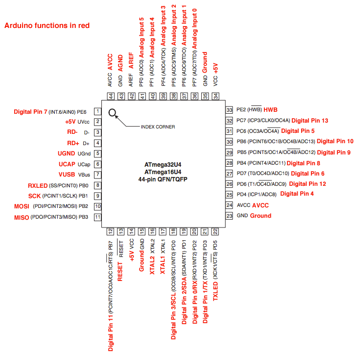

# Compilation of all devices FWIW

## kbmount

### Base station v01

Layout: [EasyEDA](https://easyeda.com/editor#id=f628803081e241f58fbca507a0f69ea2)

Pins: 

* Status LED: mcu-pin-12 / PB7          // Arduino D11

Breakout row 1: 

* VCC / +5v
* MOSI    // mcu-pin-10 / PB2           // Arduino D16
* RESET   // mcu-pin-13
* A3      // mcu-pin-39 / PF4 / ADC4    // Arduino D21 / A3
* A1      // mcu-pin-37 / PF6 / ADC6    // Arduino D19 / A1
* D5      // mcu-pin-31 / PC6           // Arduino D5
* D9      // mcu-pin-29 / PB5           // Arduino D9
* D6      // mcu-pin-27 / PD7 / ADC10   // Arduino D6
* D1      // mcu-pin-21 / PD3           // Arduino D1
* D2      // mcu-pin-19 / PD1           // Arduino D2

Breakout row 2:

* MISO    // mcu-pin-11 / PB3           // Arduino D14
* SCK     // mcu-pin-09 / PB1           // Arduino D15
* D7      // mcu-pin-01 / PE6           // Arduino D7
* A2      // mcu-pin-38 / PF5 / ADC5    // Arduino D20
* A0      // mcu-pin-36 / PF7 / ADC7    // Arduino D18
* D10     // mcu-pin-30 / PB6 / ADC13   // Arduino D10
* D8      // mcu-pin-28 / PB4 / ADC11   // Arduino D8
* D4      // mcu-pin-25 / PD4 / ADC8    // Arduino D4
* D0      // mcu-pin-29 / PB5 / ADC12   // Arduino D0
* D3      // mcu-pin-18 / PD0           // Arduino D3

### 2-key + LED (2key1) v01

Layout: [EasyEDA](https://easyeda.com/editor#id=6b24a128ba4740b6b5e9942bfe6ee795)

Pins:

* Col 1: A3   // mcu-pin-39 / PF4 / ADC4
* LED 1: MOSI // mcu-pin-10 / PB2 
* Col 2: D6   // mcu-pin-27 / PD7 / ADC10
* LED 2: D1   // mcu-pin-21 / PD3
* Row 1: A1   // mcu-pin-37 / PF6 / ADC6

### 2-key + WS2812B (2key2) v01

Layout: [EasyEDA](https://easyeda.com/editor#id=99b87c081baa4b6ebea86514403502c0)

Pins:

* Col 1: A3   // mcu-pin-39 / PF4 / ADC4
* LEDs: MOSI  // mcu-pin-10 / PB2  
* Col 2: D6   // mcu-pin-27 / PD7 / ADC10
* Row 1: A1   // mcu-pin-37 / PF6 / ADC6

### 4-key + LEDs (4key1) v01

Layout: [EasyEDA](https://easyeda.com/editor#id=7a88a68e99c047d086707024e36c74ea)

Pins:

* Col 1: A3   // mcu-pin-39 / PF4 / ADC4
* Col 2: D6   // mcu-pin-27 / PD7 / ADC10
* Row 1: A1   // mcu-pin-37 / PF6
* Row 2: D5   // mcu-pin-31 / PC6 
* LED 1: MOSI // mcu-pin-10 / PB2  
* LED 2: D1   // mcu-pin-21 / PD3
* LED 3: D9   // mcu-pin-29 / PB5
* LED 4: D2   // mcu-pin-19 / PD1

### 4-key + WS2812 (4key2) v01

Layout: [EasyEDA](https://easyeda.com/editor#id=d1e8a80b96f24108af61bd66a0b2b66a)

Pins:

* Col 1: A3   // mcu-pin-39 / PF4 / ADC4
* Col 2: D6   // mcu-pin-27 / PD7 / ADC10
* Row 1: A1   // mcu-pin-37 / PF6
* Row 2: D5   // mcu-pin-31 / PC6 
* LEDs:  MOSI // mcu-pin-10 / PB2  

### 6-key + WS2812B (6key2) v01

Layout: [EasyEDA](https://easyeda.com/editor#id=9c8eb80f2fad49589a61e6b9125c3820)

Pins:

* Col 1: A3   // mcu-pin-39 / PF4 / ADC4
* Col 2: D6   // mcu-pin-27 / PD7 / ADC10
* Col 3: D1   // mcu-pin-21 / PD3
* Row 1: A1   // mcu-pin-37 / PF6
* Row 2: D5   // mcu-pin-31 / PC6 
* LEDs:  MOSI // mcu-pin-10 / PB2  

## Touch

### Tv03

Board ID: CLICKERTOUCH_V03

Layout: [EasyEDA](https://easyeda.com/editor#id=e49446fbb07a41f892e86231c77ac6a3)

Pins:

* Button/Touch 1: mcu-pin-40 / PF1 / ADC1 -> Arduino A4 / D22
* Button/Touch 2: mcu-pin-39 / PF4 / ADC4 / TCK -> Arduino A3 / D21
* LEDs (4x WS2812B-2020): mcu-pin-1 / PE6 / INT.6 / AIN0 -> Arduino D7

## Kai

### Kai01

Layout: [EasyEDA](https://easyeda.com/editor#id=?)

Breakout part 1: 

* GND
* ROW1    // mcu-pin-41 / PF0           // Arduino D23
* ROW2    // mcu-pin-40 / PF1           // Arduino D22
* COL1    // mcu-pin-39 / PF4           // Arduino D21
* COL2    // mcu-pin-38 / PF5           // Arduino D20
* COL3    // mcu-pin-37 / PF6           // Arduino D19
* LED1    // mcu-pin-36 / PF7           // Arduino D18

Breakout part 2: 

* GND
* LED2    // mcu-pin-31 / PC6           // Arduino D5
* LED3    // mcu-pin-30 / PB6           // Arduino D10
* LED4    // mcu-pin-29 / PB5           // Arduino D9
* LED5    // mcu-pin-28 / PB4           // Arduino D8
* LED6    // mcu-pin-27 / PD7           // Arduino D6
* NC

Also

* MOSI    // mcu-pin-10 / PB2           // Arduino D16
* MISO    // mcu-pin-11 / PB3           // Arduino D14
* SCK     // mcu-pin-09 / PB1           // Arduino D15

## "Clickers"

From https://github.com/softplus/clickers/blob/main/boards.md 

### v05 - "A"

Board ID: CLICKER_V05 / [EasyEDA](https://easyeda.com/account/project/detail?project=d9837a8554f641aa85bcfcf978b15f49)

Pins:

* Button: mcu-pin-41 / PF0 / ADC0  -> Arduino A5 / D23
* LED button: mcu-pin-37 / PD6/ ADC6 / TD0 -> Arduino A1 / D19
* LED onboard: mcu-pin-38 / PF5 / ADC5 / TMS -> Arduino A2 D20
* Extra pin: mcu-pin-36 / PF7 / ADC7 / TDI -> Arduino A0 / D18

### v08 - "B"

Board ID: CLICKER_V08A / [EasyEDA](https://easyeda.com/editor#id=dbd548807ee744e199789b77fe63065b)

Pins:

* Button: mcu-pin-32 / PC7 / ICP03 / CLK0 / OC4A          -> Arduino D13 
* LED button: mcu-pin-30 / PB6 / PCINT6 / OC1B / OC4B / ADC13 -> Arduino D10
* LED onboard: mcu-pin-21 / PD3 / TXD1 / NT3                   -> Arduino D1

### v08R - "C"

Board ID: CLICKER_V08R / [EasyEDA](https://easyeda.com/editor#id=d63157773b2e42889e12097fb3704eb7)

Pins:

* Button: mcu-pin-39 / PF4 / ADC4 / TCK -> Arduino A3 / D21
* LED button: mcu-pin-40 / PF1 / ADC1       -> Arduino A4 / D22
* LED onboard: mcu-pin-37 / PF6 / ADC6 / TD0 -> Arduino A1 / D19

### v10 - "D"

Board ID: CLICKER_V10 / [EasyEDA](https://easyeda.com/editor#id=bcfc8b29abb7485e996b500a93c32a2f)

Note: pads don't fit low-profile keycaps

Pins: (same as v08R)

* Button: mcu-pin-39 / PF4 / ADC4 / TCK -> Arduino Analog 3 (A3) / Pin #21
* LED button: mcu-pin-40 / PF1 / ADC1       -> Arduino Analog 4 (A4) / Pin #22
* LED onboard: mcu-pin-37 / PF6 / ADC6 / TD0 -> Arduino Analog 1 (A1) / Pin #19

### v11 - "E"

Board ID: CLICKER_V11 / [EasyEDA](https://easyeda.com/editor#id=4006867a197d47b9b779dae18d11364a)

Pins: (same as v08R)

* Button: mcu-pin-39 / PF4 / ADC4 / TCK -> Arduino A3 / D21
* LED button: mcu-pin-40 / PF1 / ADC1       -> Arduino A4 / D22
* LED onboard: mcu-pin-37 / PF6 / ADC6 / TD0 -> Arduino A1 / D19

# Notes

## ATmega 32U4 pin mapping:

(from https://www.arduino.cc/en/Hacking/PinMapping32u4 )
