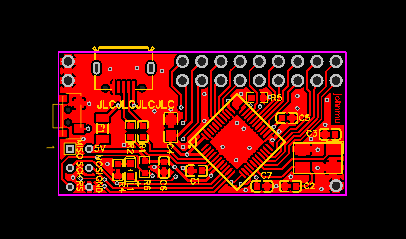
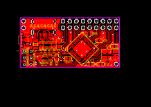

# kbmount - a modular macro-keyboard base board

Status: ok

## Pins

Left/Top: 

1. GND
2. GND

Top row:

1. MOSI / PB2 / D16
2. VCC (+5v via USB, no regulator / max 500mA)
3. PF4 / D21 / A3
4. PF6 / D19 / A1
5. PC6 / D5
6. PB5 / D9
7. PD7 / D6
8. PD3 / D1
9. PD1 / D2

Lower row:

1. MISO / PB3 / D14
2. SCK / PB1 / D15
3. PF5 / D20
4. PF7 / D18
5. PB6 / D10
6. PB4 / D8
7. PD4 / D4
8. PB5 / D0
9. PD0 / D3

Left/Bottom: ICSP

1. MISO
2. VCC
3. SCK
4. MOSI
5. RESET
6. GND

Right/Bottom:

1. GND

## Hardware

* Various parts :-)

## Links

* Schematic: [USB](kbmount-C/schematic.pdf)
  / [USB-A](kbmount-A/schematic.pdf)
* EasyEDA: [USB-C](https://easyeda.com/editor#id=f628803081e241f58fbca507a0f69ea2)
  / [USB-A](#)
* Gerber files: [USB-C](kbmount-C/gerber.zip)
  / [USB-A](kbmount-A/gerber.zip)
