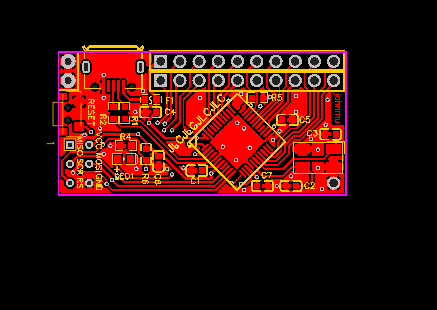

# kbmount - a modular macro-keyboard base board

Status: in redesign :-/

## Pins

Left/Top: 

1. GND
2. GND

Top row:

1. VCC (+5v via USB, no regulator)
2. MOSI // mcu-pin-10 / PB2 // Arduino D16
3. RESET // mcu-pin-13
4. mcu-pin-39 / PF4 / ADC4 // Arduino D21 / A3
5. mcu-pin-37 / PF6 / ADC6 // Arduino D19 / A1
6. mcu-pin-31 / PC6 // Arduino D5
7. mcu-pin-29 / PB5 // Arduino D9
8. mcu-pin-27 / PD7 / ADC10 // Arduino D6
9. mcu-pin-21 / PD3 // Arduino D1
10. mcu-pin-19 / PD1 // Arduino D2

Lower row:

1. MISO // mcu-pin-11 / PB3 // Arduino D14
2. SCK // mcu-pin-09 / PB1 // Arduino D15
3. mcu-pin-01 / PE6 // Arduino D7
4. mcu-pin-38 / PF5 / ADC5 // Arduino D20
5. mcu-pin-36 / PF7 / ADC7 // Arduino D18
6. mcu-pin-30 / PB6 / ADC13 // Arduino D10
7. mcu-pin-28 / PB4 / ADC11 // Arduino D8
8. mcu-pin-25 / PD4 / ADC8 // Arduino D4
9. mcu-pin-29 / PB5 / ADC12 // Arduino D0
10. mcu-pin-18 / PD0 // Arduino D3

Left/Bottom: ICSP

1. MISO
2. VCC
3. SCK
4. MOSI
5. RESET
6. GND

Right/Bottom:

1. GND

## Hardware

* Various parts :-)

## Links

* [Schematic](schematic.pdf)
* [EasyEDA v1](https://easyeda.com/editor#id=f628803081e241f58fbca507a0f69ea2)
* [Gerber files v1](gerber.zip)
