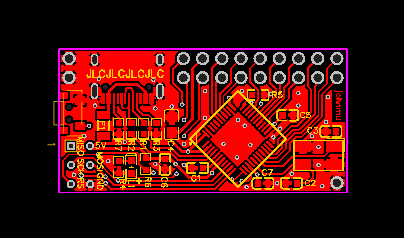

# kbmount - a modular macro-keyboard base board

The hardware components are chosen so that they can be repurposed from a [Pro-Micro](https://www.sparkfun.com/products/12640) dev-board.

Status: ok

## Pins

Left/Top: 

1. GND
2. GND

Top row:

1. MOSI / PB2 / D16
2. VCC (+5v via USB, no regulator / max 500mA)
3. PF4 / D21 / A3
4. PF6 / D19 / A1
5. PC6 / D5
6. PB5 / D9
7. PD7 / D6
8. PD3 / D1
9. PD1 / D2

Lower row:

1. MISO / PB3 / D14
2. SCK / PB1 / D15
3. PF5 / D20
4. PF7 / D18
5. PB6 / D10
6. PB4 / D8
7. PD4 / D4
8. PB5 / D0
9. PD0 / D3

Left/Bottom: ICSP

1. MISO
2. VCC
3. SCK
4. MOSI
5. RESET
6. GND

Right/Bottom:

1. GND

## Links

### USB-A

* Schematic: [USB-A](kbmount-A/schematic.pdf)
* BOM: [USB-A](kbmount-A/bom.csv)
* EasyEDA: [USB-A](https://easyeda.com/editor#id=4fe9ac0ac0ab433d97261808a5d28d88)
* Gerber files: [USB-A](kbmount-A/gerber.zip)
* EasyEDA JSON: [Schematic](kbmount-A/../../2key2/easyeda-schematic.json) 
  / [PCB](kbmount-A/easyeda-pcb.json)

### USB-C

* Schematic: [USB-C](kbmount-C/schematic.pdf)
* BOM: [USB-C](kbmount-C/bom.csv)
* EasyEDA: [USB-C](https://easyeda.com/editor#id=669732bc1907417faeabc9041bedee62)
* Gerber files: [USB-C](kbmount-C/gerber.zip)
* EasyEDA JSON: [Schematic](kbmount-C/../../2key2/easyeda-schematic.json) 
  / [PCB](kbmount-C/easyeda-pcb.json)

## Hardware

The following parts are necessary in addition to a working Pro-Micro board:

USB-A:

* 1x 0603 100nF Capacitor
* 1x 0603 10k Resistor
* 1x USB-A micro plug
* 1x reset switch (2mm x 4mm x 3.5mm side-mounted)

USB-C:

* 1x 0603 100nF Capacitor
* 1x 0603 10k Resistor
* 2x 5.1k Resistor
* 1x USB-C plug
* 1x reset switch (2mm x 4mm x 3.5mm side-mounted)

If the ATmega32u4 is reused from a Pro-Micro, the ICSP connector is not needed, since it already contains the Caterina firmware.
